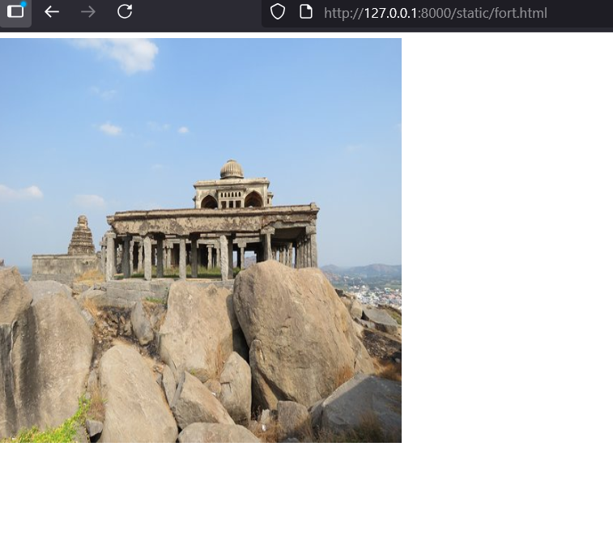

# Ex04 Places Around Me
## Date: 08/10/25

## AIM
To develop a website to display details about the places around my house.

## DESIGN STEPS

### STEP 1
Create a Django admin interface.

### STEP 2
Download your city map from Google.

### STEP 3
Using ```<map>``` tag name the map.

### STEP 4
Create clickable regions in the image using ```<area>``` tag.

### STEP 5
Write HTML programs for all the regions identified.

### STEP 6
Execute the programs and publish them.

## CODE
```
static
map.html

<!DOCTYPE html>
<html lang="en">
<head>
    <meta charset="UTF-8">
    <meta name="viewport" content="width=device-width, initial-scale=1.0">
    <title>Document</title>
</head>
<body>
    
    <!-- Image Map Generated by http://www.image-map.net/ -->
    

<map name="image-map">
    <area target="" alt="gingee" title="gingee" href="fort.html" coords="766,291,1075,453" shape="rect">
    <area target="" alt="thindivanam" title="thindivanam" href="beach.html" coords="1344,292,1573,359,1632,565,1270,500" shape="poly">
    <area target="" alt="thiruvannamalai" title="thiruvannamalai" href="temple.html" coords="177,397,199" shape="circle">
</map>
</body>
</html>

fort.html

<!DOCTYPE html>
<html lang="en">
<head>
    <meta charset="UTF-8">
    <meta name="viewport" content="width=device-width, initial-scale=1.0">
    <title>Document</title>
</head>
<body>
    
</body>
</html>

beach.html

<!DOCTYPE html>
<html lang="en">
<head>
    <meta charset="UTF-8">
    <meta name="viewport" content="width=device-width, initial-scale=1.0">
    <title>Document</title>
</head>
<body>
    
</body>
</html>

temple.html

<!DOCTYPE html>
<html lang="en">
<head>
    <meta charset="UTF-8">
    <meta name="viewport" content="width=device-width, initial-scale=1.0">
    <title>Document</title>
</head>
<body>
    
</body>
</html>
```
## OUTPUT




## RESULT
The program for implementing image maps using HTML is executed successfully.
